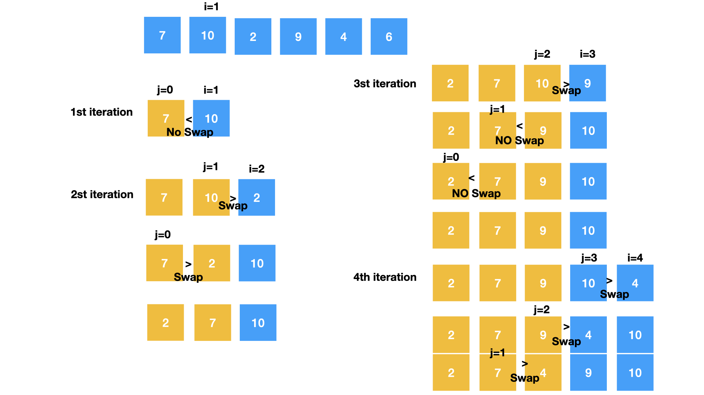

## 선택정렬

- 임의의 tempMin을 정한다음 진짜 최소값을 찾기위해 요소의 첫번째부터 마지막까지 순회를 하면서 tempMin과 비교하면서 최소값을 찾는다.

- 요소의 첫번째부터 마지막까지 돌아 최소값을 찾았다면, 그 배열의 앞쪽 index와 현재 최소값 index를 swap한다.

- 다음 최소값을 찾기위한 tempMin은 현재 배열에서 정렬이 된 원소들 중의 마지막 원소의 index+1(다음 인덱스)가 되고,

- 순회를 하는 시작점은 tempMin 인덱스 +1 부터 마지막까지 순회를 하며 tempMin과 비교하여 가장 최소값을 찾는다.

- 이런식으로 반복한다.

- Outer loop이 한번 돌 때마다, 최소값이 확정되고 그 최소값의 정렬 위치도 확정된다.

#### Time Compolexity

Worst : O(n^2)
Best : O(n^2)

## 삽입정렬

- 삽입정렬은 매 순회시 i(인덱스)가 늘어감에 따라, 0부터 i(인덱스)까지의 범위를 observe 하면서 정렬한다.



```javascript
const selectionSort = (arr) => {
  let minIndex = Number.MAX_SAFE_INTEGER;
  let copiedArr = [...arr];
  for (let i = 0; i < copiedArr.length - 1; i++) {
    minIndex = i;
    for (let j = i + 1; j < copiedArr.length; j++) {
      if (copiedArr[minIndex] > copiedArr[j]) {
        minIndex = j;
      }
    }
    [copiedArr[minIndex], copiedArr[i]] = [
      copiedArr[i],
      copiedArr[minIndex],
    ];
  }
  return copiedArr;
};
```

WORST: O(n^2)
BEST : O(n^2)
